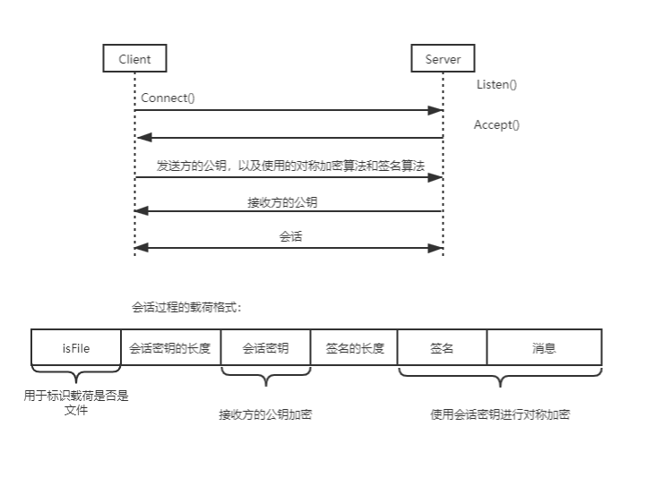

# SecureNetworkComunicate

研究生课程期末大作业  

实现一个带有 UI 界面的点对点网络通信程序，并且实现密钥封装协议以对通信的消息进行加密，并且每条消息都需要使用 DSA 数字签名进行签名。  

这个项目中包含的内容有：
- 使用 Miller-Rabbin 素性检测方法实现的生成大素数的算法  
- 实现了常见的安全算法，比如 AES 和 3DES 加密算法，RSA加密算法以及DSA 数字签名算法，MD5 以及 SHA-3 哈希算法  
- 设计并实现了一种基于密钥封装协议的安全网络通信协议  

这个课程项目是单人项目，最后课程作业评级为优秀。

## 安全网络通信协议的设计

这里实现了一种基于密钥封装协议的安全网络通信协议，该协议的流程以及有效载荷字段如下图所示：  

如图所示，发送方需要先发送自己的公钥到接收方，并且协商将要使用的加密算法和哈希算法。 随后接收方将会把自己的公钥返回给发送方，从而完成公钥的交换过程，会话双方有了对方的公钥之后就可以通过基于密钥封装协议的安全通信协议进行安全通信。  

方案中的会话密钥的长度固定为128比特（DES加密选项实现为3DES，每一轮DES的密钥为64比特），而RSA公私钥的大整数N = p × q，其中p 和 q 是256比特的素数。  

发送的消息既可以是简单的字符串，也可以是ASCII字符的文件。  

## 效果展示

  

